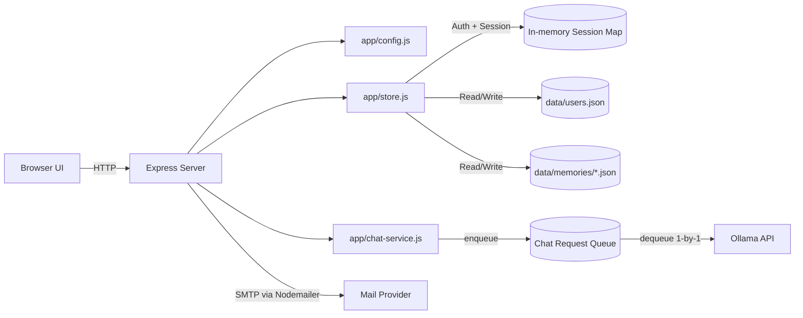

<div align="center">

[한국어](./README.md) | [ENGLISH](./readme_en.md)

# ollama-chat-service-template


</div>

브랜딩 가능한 웹 UI, 이메일 인증 흐름, 세션 기반 인증, 사용자별 대화 이력 저장을 포함한
**Ollama 채팅 서비스 템플릿**입니다.

Node.js + Express 기반이며, 책임을 모듈 단위로 분리해 유지보수와 확장이 쉽도록 구성했습니다.

## Features

- 이메일 가입 및 인증
- `HttpOnly` 쿠키 세션 기반 로그인/로그아웃
- Ollama 연동 채팅 API (`/api/chat/send`)
- 사용자별 대화 이력 파일 저장
- 환경변수 기반 브랜딩 문자열 커스터마이징
- 환경변수 기반 인증 메일 제목/본문 커스터마이징
- 단일 Ollama 장비를 위한 내장 FIFO 요청 큐
- 요청 타임아웃 및 최근 메시지 보존 개수 제어

## Architecture



## Module Responsibilities

- `server.js`: Express 부트스트랩, 라우트 등록, 페이지 렌더링, HTTP 에러 매핑
- `app/config.js`: `.env` 로딩, 경로 상수, 런타임/앱/메일/큐 설정
- `app/store.js`: 사용자/세션/메모리 저장, 인증 미들웨어
- `app/chat-service.js`: FIFO 큐 워커, Ollama 호출 파이프라인, 채팅 상태 제공

## Quick Start

### 1) Requirements

- Node.js 18+ (권장: 20+)
- npm
- 실행 중인 Ollama 서버
- SMTP 발송 가능한 이메일 계정 (기본값: Gmail)

### 2) 의존성 설치

```bash
npm install
```

### 3) `.env` 설정

템플릿에는 예시값이 포함된 `.env`가 이미 있습니다.  
배포 전에 반드시 실제 값으로 교체하세요.

```env
# App
PORT=3000
BASE_URL=http://localhost:3000
APP_NAME=EXAMPLE_CHAT
APP_CHAT_TITLE=my chat
APP_CONSOLE_LABEL=EXAMPLE_CHAT Console

# Ollama
OLLAMA_URL=http://localhost:11434/api/chat
OLLAMA_MODEL=BASIC_MODEL
OLLAMA_TIMEOUT_MS=60000
MAX_RECENT_MESSAGES=30
CHAT_QUEUE_MAX_PENDING=100

# Session
SESSION_COOKIE_NAME=chat_session

# Mail
MAIL_SERVICE=gmail
MAIL_USER=example@gmail.com
MAIL_PASSWORD=example_password
MAIL_FROM_NAME=EXAMPLE_CHAT
MAIL_VERIFY_SUBJECT=[EXAMPLE_CHAT] Email verification
MAIL_VERIFY_HEADING=EXAMPLE_CHAT Email verification
MAIL_VERIFY_MESSAGE=Click the link below to complete your membership verification.

# Optional (single line)
# SYSTEM_PROMPT=You are a helpful assistant.
```

### 4) 실행

```bash
npm start
```

그다음 `http://localhost:3000` 접속:

1. 회원가입
2. 이메일 인증 링크 클릭
3. 로그인
4. 채팅 시작

## Environment Variables

| Key | Default | 설명 |
|---|---|---|
| `PORT` | `3000` | 서버 포트 |
| `BASE_URL` | `http://localhost:${PORT}` | 이메일 인증 링크 생성에 사용 |
| `APP_NAME` | `SAMPLE_TITLE` | 인증/완료 페이지 브랜드명 |
| `APP_CHAT_TITLE` | `my chat` | 채팅 페이지 메인 타이틀 |
| `APP_CONSOLE_LABEL` | `${APP_NAME} Console` | 채팅 페이지 서브 타이틀 |
| `OLLAMA_URL` | `http://localhost:11434/api/chat` | Ollama 채팅 엔드포인트 |
| `OLLAMA_MODEL` | `BASIC_MODEL` | Ollama 호출 모델명 |
| `OLLAMA_TIMEOUT_MS` | `60000` | Ollama 요청 타임아웃(ms) |
| `MAX_RECENT_MESSAGES` | `30` | 사용자별 최근 메시지 보존 개수 |
| `CHAT_QUEUE_MAX_PENDING` | `100` | 신규 요청 거부 전 최대 대기+실행 작업 수 |
| `SESSION_COOKIE_NAME` | `chat_session` | 세션 쿠키 키 |
| `MAIL_SERVICE` | `gmail` | Nodemailer 서비스 |
| `MAIL_USER` | `your_gmail_account` | SMTP 계정 |
| `MAIL_PASSWORD` | `mail_password` | SMTP 비밀번호 또는 앱 비밀번호 |
| `MAIL_FROM_NAME` | `APP_NAME` | 발신자 표시 이름 |
| `MAIL_VERIFY_SUBJECT` | `[APP_NAME] Email verification` | 인증 메일 제목 |
| `MAIL_VERIFY_HEADING` | `${APP_NAME} Email verification` | 인증 메일 헤딩 |
| `MAIL_VERIFY_MESSAGE` | 기본 안내 문구 | 인증 메일 본문 |
| `SYSTEM_PROMPT` | 내장 템플릿 | 모델로 전달하는 시스템 프롬프트 |

참고:

- 내장 `.env` 로더는 한 줄 단위 파싱 방식입니다. `SYSTEM_PROMPT`는 한 줄 입력을 권장합니다.
- `PORT`, `OLLAMA_TIMEOUT_MS`, `MAX_RECENT_MESSAGES`, `CHAT_QUEUE_MAX_PENDING`는 양의 정수여야 합니다.

## Project Structure

```text
.
├─ server.js
├─ app
│  ├─ config.js
│  ├─ store.js
│  └─ chat-service.js
├─ package.json
├─ .env
├─ data
│  ├─ users.json
│  └─ memories/
└─ public
   ├─ index.html
   ├─ register.html
   ├─ verified.html
   ├─ main.html
   └─ style.css
```

## Routes and APIs

### Page Routes

- `GET /` 로그인 페이지
- `GET /register` 회원가입 페이지
- `GET /verified` 인증 완료 페이지
- `GET /chat` 채팅 페이지 (인증 필요)
- `GET /verify-email?token=...` 이메일 인증 콜백

### Auth APIs

#### `POST /api/auth/register`

요청:

```json
{
  "email": "user@example.com",
  "password": "password1234"
}
```

성공:

```json
{
  "ok": true,
  "message": "We have sent you a verification email."
}
```

주요 에러:

- `400` 이메일 형식 오류
- `400` 비밀번호 8자 미만
- `409` 이미 가입 및 인증 완료된 이메일
- `500` 인증 메일 발송 실패

#### `POST /api/auth/login`

요청:

```json
{
  "email": "user@example.com",
  "password": "password1234"
}
```

성공:

```json
{
  "ok": true,
  "email": "user@example.com"
}
```

주요 에러:

- `401` 이메일 또는 비밀번호 불일치
- `403` 이메일 미인증

#### `POST /api/auth/logout`

성공:

```json
{
  "ok": true
}
```

#### `GET /api/auth/me`

성공:

```json
{
  "email": "user@example.com"
}
```

에러:

- `401` unauthorized

### Chat APIs

#### `GET /api/chat/history`

성공:

```json
{
  "messages": [
    { "role": "user", "content": "Hello", "timestamp": 1730000000000 },
    { "role": "assistant", "content": "Hi", "timestamp": 1730000001000 }
  ],
  "isBusy": false,
  "queue": {
    "totalPending": 2,
    "maxPending": 100
  }
}
```

#### `POST /api/chat/send`

요청:

```json
{
  "content": "Summarize my tasks for today."
}
```

성공:

```json
{
  "assistant": {
    "role": "assistant",
    "content": "...",
    "timestamp": 1730000002000
  }
}
```

주요 에러:

- `400` `content is required`
- `503` `Chat queue is full. Please try again shortly.`
- `500` 타임아웃 또는 Ollama 응답 실패

## Persistence Model

### `data/users.json`

```json
{
  "users": [
    {
      "email": "user@example.com",
      "passwordHash": "salt:hash",
      "verified": true,
      "verifyToken": "",
      "createdAt": 1730000000000,
      "updatedAt": 1730000000000,
      "verifiedAt": 1730000000000
    }
  ]
}
```

### `data/memories/<base64url(email)>.json`

```json
{
  "longTerm": "",
  "messages": [
    { "role": "user", "content": "hello", "timestamp": 1730000000000 },
    { "role": "assistant", "content": "hi", "timestamp": 1730000001000 }
  ],
  "updatedAt": 1730000001000
}
```

## Customization Guide

### 브랜딩/문구 변경

- `APP_NAME`
- `APP_CHAT_TITLE`
- `APP_CONSOLE_LABEL`
- `MAIL_VERIFY_SUBJECT`
- `MAIL_VERIFY_HEADING`
- `MAIL_VERIFY_MESSAGE`
- 확인 파일: `app/config.js`

### 모델 전환

- `OLLAMA_MODEL` 값을 변경해 모델 전환
- `OLLAMA_URL`을 로컬/원격/프록시 Ollama로 변경
- 확인 파일: `app/config.js`, `app/chat-service.js`

### 프롬프트 튜닝

- `SYSTEM_PROMPT`로 서비스 톤/정책 반영
- 현재 `.env` 파서 기준 한 줄 입력 권장
- 확인 파일: `app/config.js`, `app/chat-service.js`

### 동시성 정책

이 템플릿은 FIFO 요청 큐를 사용하므로 여러 클라이언트 요청을 동시에 받을 수 있습니다.
단, 단일 장비 운영을 전제로 Ollama 호출은 한 번에 1개씩 순차 처리됩니다.

- 신규 요청은 메모리 큐에 적재
- 워커가 작업을 순차 처리
- 큐 용량은 `CHAT_QUEUE_MAX_PENDING`으로 제어
- 큐 포화 시 `/api/chat/send`가 `503` 반환
- 확인 파일: `app/chat-service.js`

## Production Checklist

- `.env` 예시값을 실제 값으로 교체했는지 확인
- SMTP 자격증명을 안전하게 설정했는지 확인 (앱 비밀번호/토큰 권장)
- HTTPS 리버스 프록시(Nginx/Caddy 등) 뒤에 배치했는지 확인
- 세션 저장소를 인메모리에서 Redis 등으로 전환할지 검토
- `data/` 백업/복구 전략 수립

## Troubleshooting

| 증상 | 확인 항목 |
|---|---|
| 인증 메일 발송 실패 | `MAIL_SERVICE`, `MAIL_USER`, `MAIL_PASSWORD`, 메일 제공자 보안 설정 |
| 로그인 후 `/chat` 접근 불가 | 브라우저 쿠키 정책, 도메인/포트 불일치 |
| 채팅 요청 실패 지속 | `OLLAMA_URL` 연결 가능 여부, `OLLAMA_MODEL` 존재 여부 |
| `Chat queue is full` 발생 | `CHAT_QUEUE_MAX_PENDING` 상향 또는 요청 부하 완화 |
| 다수 사용자 시 응답 지연 | 단일 워커 큐 특성상 정상, Ollama 처리 용량 증설 검토 |
| 타임아웃 빈발 | `OLLAMA_TIMEOUT_MS` 증가 또는 모델/런타임 최적화 |

## Scripts

```bash
npm start
```

## License

원하는 라이선스(예: MIT)를 추가한 뒤 배포하세요.
