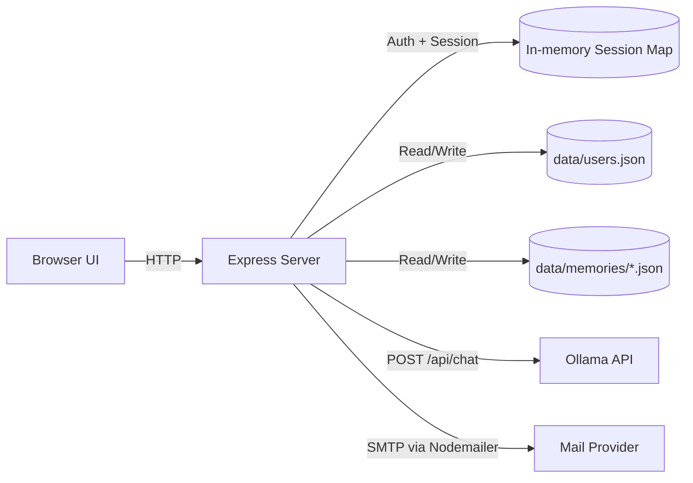

# ollama-chat-service-template

브랜딩 가능한 웹 UI, 이메일 인증, 세션 로그인, 사용자별 대화 메모리까지 포함한 **Ollama 채팅 서비스 템플릿**입니다.  
Node.js + Express 기반으로 빠르게 시작하고, `.env`만 수정해 서비스 이름/모델/메일 설정을 교체할 수 있습니다.

## What You Get

- 이메일 인증 기반 회원가입/로그인
- 쿠키 세션 인증 (`HttpOnly`, `SameSite=Lax`)
- Ollama 연동 채팅 API (`/api/chat/send`)
- 사용자별 대화 이력 파일 저장 (`data/memories/*.json`)
- 최근 메시지 개수 자동 제한 (`MAX_RECENT_MESSAGES`)
- 서비스 브랜딩 문자열 환경변수화 (`APP_NAME`, `APP_CHAT_TITLE` 등)
- 메일 제목/본문 환경변수화 (`MAIL_VERIFY_*`)

## Architecture



## Quick Start

### 1) Requirements

- Node.js 18+ (권장: 20+)
- npm
- 실행 중인 Ollama 서버
- 메일 발송 가능한 계정 (기본: Gmail)

### 2) Install

```bash
npm install
```

### 3) Configure `.env`

이미 템플릿에 예시값 `.env`가 포함되어 있습니다.  
실서비스 전에는 값을 반드시 교체하세요.

```env
# App
PORT=3000
BASE_URL=http://localhost:3000
APP_NAME=EXAMPLE_CHAT
APP_CHAT_TITLE=my chat
APP_CONSOLE_LABEL=EXAMPLE_CHAT Console

# Ollama
OLLAMA_URL=http://localhost:11434/api/chat
OLLAMA_MODEL=BASIC_MODEL
OLLAMA_TIMEOUT_MS=60000
MAX_RECENT_MESSAGES=30

# Session
SESSION_COOKIE_NAME=chat_session

# Mail
MAIL_SERVICE=gmail
MAIL_USER=example@gmail.com
MAIL_PASSWORD=example_password
MAIL_FROM_NAME=EXAMPLE_CHAT
MAIL_VERIFY_SUBJECT=[EXAMPLE_CHAT] Email verification
MAIL_VERIFY_HEADING=EXAMPLE_CHAT Email verification
MAIL_VERIFY_MESSAGE=Click the link below to complete your membership verification.

# Optional (single line)
# SYSTEM_PROMPT=You are a helpful assistant.
```

### 4) Run

```bash
npm start
```

브라우저에서 `http://localhost:3000` 접속 후:

1. 회원가입
2. 이메일 인증 링크 클릭
3. 로그인
4. 채팅 시작

## Environment Variables Reference

| Key | Default | Description |
|---|---|---|
| `PORT` | `3000` | 서버 포트 |
| `BASE_URL` | `http://localhost:${PORT}` | 이메일 인증 링크 생성에 사용 |
| `APP_NAME` | `SAMPLE_TITLE` | 로그인/회원가입/완료 페이지 서비스명 |
| `APP_CHAT_TITLE` | `my chat` | 채팅 페이지 메인 타이틀 |
| `APP_CONSOLE_LABEL` | `${APP_NAME} Console` | 채팅 페이지 서브 타이틀 |
| `OLLAMA_URL` | `http://localhost:11434/api/chat` | Ollama Chat API URL |
| `OLLAMA_MODEL` | `BASIC_MODEL` | 호출할 모델명 |
| `OLLAMA_TIMEOUT_MS` | `60000` | Ollama 요청 타임아웃(ms) |
| `MAX_RECENT_MESSAGES` | `30` | 사용자별 최근 메시지 저장 개수 |
| `SESSION_COOKIE_NAME` | `chat_session` | 세션 쿠키 이름 |
| `MAIL_SERVICE` | `gmail` | Nodemailer 서비스 이름 |
| `MAIL_USER` | `your_gmail_account` | 발신 메일 계정 |
| `MAIL_PASSWORD` | `mail_password` | 발신 메일 비밀번호/앱 비밀번호 |
| `MAIL_FROM_NAME` | `APP_NAME` | 발신자 표시 이름 |
| `MAIL_VERIFY_SUBJECT` | `[APP_NAME] Email verification` | 인증 메일 제목 |
| `MAIL_VERIFY_HEADING` | `${APP_NAME} Email verification` | 인증 메일 헤더 |
| `MAIL_VERIFY_MESSAGE` | 안내 문구 | 인증 메일 본문 문구 |
| `SYSTEM_PROMPT` | 기본 템플릿 | 시스템 프롬프트 (한 줄 권장) |

주의:

- 현재 `.env` 파서는 **라인 단위**로 읽습니다. `SYSTEM_PROMPT`는 멀티라인보다 한 줄 사용을 권장합니다.
- `PORT`, `OLLAMA_TIMEOUT_MS`, `MAX_RECENT_MESSAGES`는 양의 정수만 유효합니다.

## Project Structure

```text
.
├─ server.js
├─ package.json
├─ .env
├─ data
│  ├─ users.json
│  └─ memories/
└─ public
   ├─ index.html
   ├─ register.html
   ├─ verified.html
   ├─ main.html
   └─ style.css
```

## API Reference

### Page Routes

- `GET /` 로그인 페이지
- `GET /register` 회원가입 페이지
- `GET /verified` 인증 완료 페이지
- `GET /chat` 채팅 페이지 (로그인 필요)
- `GET /verify-email?token=...` 이메일 인증 처리

### Auth APIs

#### `POST /api/auth/register`

Request:

```json
{
  "email": "user@example.com",
  "password": "password1234"
}
```

Success:

```json
{
  "ok": true,
  "message": "We have sent you a verification email."
}
```

Possible errors:

- `400` 이메일 형식 오류
- `400` 비밀번호 8자 미만
- `409` 이미 가입된(검증 완료) 이메일
- `500` 인증 메일 발송 실패

#### `POST /api/auth/login`

Request:

```json
{
  "email": "user@example.com",
  "password": "password1234"
}
```

Success:

```json
{
  "ok": true,
  "email": "user@example.com"
}
```

Possible errors:

- `401` 이메일/비밀번호 불일치
- `403` 이메일 미인증

#### `POST /api/auth/logout`

Success:

```json
{
  "ok": true
}
```

#### `GET /api/auth/me`

Success:

```json
{
  "email": "user@example.com"
}
```

Error:

- `401` Unauthorized

### Chat APIs

#### `GET /api/chat/history`

Success:

```json
{
  "messages": [
    { "role": "user", "content": "Hello", "timestamp": 1730000000000 },
    { "role": "assistant", "content": "Hi", "timestamp": 1730000001000 }
  ],
  "isBusy": false
}
```

#### `POST /api/chat/send`

Request:

```json
{
  "content": "오늘 할 일을 정리해줘."
}
```

Success:

```json
{
  "assistant": {
    "role": "assistant",
    "content": "...",
    "timestamp": 1730000002000
  }
}
```

Possible errors:

- `400` `content is required`
- `409` `LLM is busy. Only one user allowed.`
- `500` Ollama 타임아웃 또는 응답 실패

## Persistence Model

### `data/users.json`

```json
{
  "users": [
    {
      "email": "user@example.com",
      "passwordHash": "salt:hash",
      "verified": true,
      "verifyToken": "",
      "createdAt": 1730000000000,
      "updatedAt": 1730000000000,
      "verifiedAt": 1730000000000
    }
  ]
}
```

### `data/memories/<base64url(email)>.json`

```json
{
  "longTerm": "",
  "messages": [
    { "role": "user", "content": "hello", "timestamp": 1730000000000 },
    { "role": "assistant", "content": "hi", "timestamp": 1730000001000 }
  ],
  "updatedAt": 1730000001000
}
```

## Customization Guide

### 1) 브랜드명/문구 교체

- `APP_NAME`, `APP_CHAT_TITLE`, `APP_CONSOLE_LABEL`
- `MAIL_VERIFY_SUBJECT`, `MAIL_VERIFY_HEADING`, `MAIL_VERIFY_MESSAGE`

### 2) 모델 교체

- `OLLAMA_MODEL`만 바꾸면 동일 API로 모델 전환 가능
- `OLLAMA_URL`로 원격/프록시 Ollama 엔드포인트 연결 가능

### 3) 시스템 프롬프트 튜닝

- `SYSTEM_PROMPT`에 서비스 정책/톤앤매너 입력
- 현재 파서 특성상 한 줄로 작성 권장

### 4) 동시 처리 정책

현재 템플릿은 전역 락(`globalBusy`)으로 **동시에 1명의 사용자만** LLM 요청 처리합니다.  
멀티 사용자 동시 처리로 바꾸려면 전역 락 정책을 사용자 단위 락으로 변경하세요.

## Production Checklist

- `.env`의 예시값을 실값으로 교체했는지
- `MAIL_PASSWORD`를 일반 비밀번호 대신 앱 비밀번호/토큰으로 설정했는지
- 역프록시(Nginx/Caddy) 뒤에서 HTTPS 적용했는지
- 세션 저장소를 메모리(Map)에서 Redis 등 외부 저장소로 전환할지 검토했는지
- `data/` 백업 전략(스냅샷/볼륨)을 준비했는지

## Troubleshooting

| Symptom | Check |
|---|---|
| 인증 메일이 안 감 | `MAIL_SERVICE`, `MAIL_USER`, `MAIL_PASSWORD`, 발신 계정 보안 정책 확인 |
| 로그인 후 `/chat` 접근 실패 | 쿠키 차단 여부, 도메인/포트 불일치 여부 확인 |
| 채팅 요청이 계속 실패 | `OLLAMA_URL` 접속 가능 여부, `OLLAMA_MODEL` 존재 여부 확인 |
| `LLM is busy` 자주 발생 | 단일 동시 처리 정책 때문, 큐/사용자별 락으로 개선 필요 |
| 타임아웃 발생 | `OLLAMA_TIMEOUT_MS` 상향 또는 모델 응답 지연 원인 점검 |

## Scripts

```bash
npm start
```

## License

원하는 라이선스(MIT 등)를 추가해서 사용하세요.
