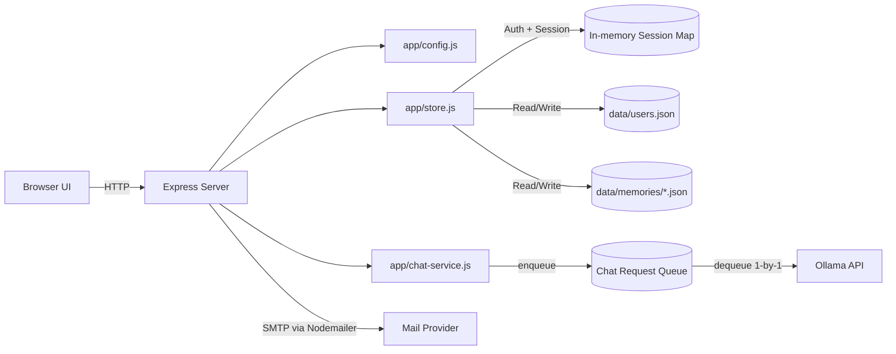

<div align="center">

[KOREAN](./README.md) | [ENGLISH](./readme_en.md)

# ollama-chat-service-template


</div>

A production-ready starter template for an Ollama-based chat service with:

- branded web UI
- email verification flow
- session-based authentication
- per-user chat history persistence

It is built with Node.js + Express, with responsibilities split into small modules so you can maintain and extend it safely.

## Features

- Email signup and verification
- Login/logout with `HttpOnly` cookie sessions
- Chat API integrated with Ollama (`/api/chat/send`)
- Per-user message history persisted to local files
- Configurable branding via environment variables
- Configurable email subject/body via environment variables
- Built-in FIFO queue for multi-client access on a single Ollama machine
- Request timeout and recent-message window controls

## Architecture



## Module Responsibilities

- `server.js`: Express bootstrap, route registration, page rendering, HTTP error mapping
- `app/config.js`: `.env` loading, path constants, runtime/app/mail/queue configuration
- `app/store.js`: users, sessions, memory persistence, auth middlewares
- `app/chat-service.js`: FIFO queue worker, Ollama call pipeline, chat history status

## Quick Start

### 1) Requirements

- Node.js 18+ (20+ recommended)
- npm
- A running Ollama server
- An email account that can send SMTP mail (Gmail by default)

### 2) Install dependencies

```bash
npm install
```

### 3) Configure `.env`

This template already includes `.env` with example values.  
Replace them before deploying.

```env
# App
PORT=3000
BASE_URL=http://localhost:3000
APP_NAME=EXAMPLE_CHAT
APP_CHAT_TITLE=my chat
APP_CONSOLE_LABEL=EXAMPLE_CHAT Console

# Ollama
OLLAMA_URL=http://localhost:11434/api/chat
OLLAMA_MODEL=BASIC_MODEL
OLLAMA_TIMEOUT_MS=60000
MAX_RECENT_MESSAGES=30
CHAT_QUEUE_MAX_PENDING=100

# Session
SESSION_COOKIE_NAME=chat_session

# Mail
MAIL_SERVICE=gmail
MAIL_USER=example@gmail.com
MAIL_PASSWORD=example_password
MAIL_FROM_NAME=EXAMPLE_CHAT
MAIL_VERIFY_SUBJECT=[EXAMPLE_CHAT] Email verification
MAIL_VERIFY_HEADING=EXAMPLE_CHAT Email verification
MAIL_VERIFY_MESSAGE=Click the link below to complete your membership verification.

# Optional (single line)
# SYSTEM_PROMPT=You are a helpful assistant.
```

### 4) Run

```bash
npm start
```

Then open `http://localhost:3000`:

1. Register
2. Click the email verification link
3. Log in
4. Start chatting

## Environment Variables

| Key | Default | Description |
|---|---|---|
| `PORT` | `3000` | Server port |
| `BASE_URL` | `http://localhost:${PORT}` | Used to build email verification links |
| `APP_NAME` | `SAMPLE_TITLE` | Brand name used on auth/verified pages |
| `APP_CHAT_TITLE` | `my chat` | Main title on chat page |
| `APP_CONSOLE_LABEL` | `${APP_NAME} Console` | Subtitle on chat page |
| `OLLAMA_URL` | `http://localhost:11434/api/chat` | Ollama chat endpoint |
| `OLLAMA_MODEL` | `BASIC_MODEL` | Model name sent to Ollama |
| `OLLAMA_TIMEOUT_MS` | `60000` | Ollama request timeout in ms |
| `MAX_RECENT_MESSAGES` | `30` | Max number of recent messages retained per user |
| `CHAT_QUEUE_MAX_PENDING` | `100` | Max queued + active chat jobs before new requests are rejected |
| `SESSION_COOKIE_NAME` | `chat_session` | Session cookie key |
| `MAIL_SERVICE` | `gmail` | Nodemailer service |
| `MAIL_USER` | `your_gmail_account` | SMTP account username/email |
| `MAIL_PASSWORD` | `mail_password` | SMTP password or app password |
| `MAIL_FROM_NAME` | `APP_NAME` | Display name in outgoing email |
| `MAIL_VERIFY_SUBJECT` | `[APP_NAME] Email verification` | Verification email subject |
| `MAIL_VERIFY_HEADING` | `${APP_NAME} Email verification` | Verification email heading |
| `MAIL_VERIFY_MESSAGE` | Default guidance text | Verification email body text |
| `SYSTEM_PROMPT` | Built-in template | System prompt sent to model |

Notes:

- The built-in `.env` loader parses one line per key. Use a single line for `SYSTEM_PROMPT`.
- `PORT`, `OLLAMA_TIMEOUT_MS`, `MAX_RECENT_MESSAGES`, and `CHAT_QUEUE_MAX_PENDING` must be positive integers.

## Project Structure

```text
.
├─ server.js
├─ app
│  ├─ config.js
│  ├─ store.js
│  └─ chat-service.js
├─ package.json
├─ .env
├─ data
│  ├─ users.json
│  └─ memories/
└─ public
   ├─ index.html
   ├─ register.html
   ├─ verified.html
   ├─ main.html
   └─ style.css
```

## Routes and APIs

### Page Routes

- `GET /` login page
- `GET /register` registration page
- `GET /verified` verification complete page
- `GET /chat` chat page (auth required)
- `GET /verify-email?token=...` email verification callback

### Auth APIs

#### `POST /api/auth/register`

Request:

```json
{
  "email": "user@example.com",
  "password": "password1234"
}
```

Success:

```json
{
  "ok": true,
  "message": "We have sent you a verification email."
}
```

Common errors:

- `400` invalid email format
- `400` password shorter than 8 characters
- `409` email already registered and verified
- `500` failed to send verification email

#### `POST /api/auth/login`

Request:

```json
{
  "email": "user@example.com",
  "password": "password1234"
}
```

Success:

```json
{
  "ok": true,
  "email": "user@example.com"
}
```

Common errors:

- `401` incorrect email or password
- `403` email not verified

#### `POST /api/auth/logout`

Success:

```json
{
  "ok": true
}
```

#### `GET /api/auth/me`

Success:

```json
{
  "email": "user@example.com"
}
```

Error:

- `401` unauthorized

### Chat APIs

#### `GET /api/chat/history`

Success:

```json
{
  "messages": [
    { "role": "user", "content": "Hello", "timestamp": 1730000000000 },
    { "role": "assistant", "content": "Hi", "timestamp": 1730000001000 }
  ],
  "isBusy": false,
  "queue": {
    "totalPending": 2,
    "maxPending": 100
  }
}
```

#### `POST /api/chat/send`

Request:

```json
{
  "content": "Summarize my tasks for today."
}
```

Success:

```json
{
  "assistant": {
    "role": "assistant",
    "content": "...",
    "timestamp": 1730000002000
  }
}
```

Common errors:

- `400` `content is required`
- `503` `Chat queue is full. Please try again shortly.`
- `500` timeout or Ollama response failure

## Persistence Model

### `data/users.json`

```json
{
  "users": [
    {
      "email": "user@example.com",
      "passwordHash": "salt:hash",
      "verified": true,
      "verifyToken": "",
      "createdAt": 1730000000000,
      "updatedAt": 1730000000000,
      "verifiedAt": 1730000000000
    }
  ]
}
```

### `data/memories/<base64url(email)>.json`

```json
{
  "longTerm": "",
  "messages": [
    { "role": "user", "content": "hello", "timestamp": 1730000000000 },
    { "role": "assistant", "content": "hi", "timestamp": 1730000001000 }
  ],
  "updatedAt": 1730000001000
}
```

## Customization Guide

### Branding and copy

- `APP_NAME`
- `APP_CHAT_TITLE`
- `APP_CONSOLE_LABEL`
- `MAIL_VERIFY_SUBJECT`
- `MAIL_VERIFY_HEADING`
- `MAIL_VERIFY_MESSAGE`
- Main file to review: `app/config.js`

### Model switching

- Change `OLLAMA_MODEL` to switch models
- Change `OLLAMA_URL` to point to local, remote, or proxied Ollama
- Main files to review: `app/config.js`, `app/chat-service.js`

### Prompt tuning

- Set `SYSTEM_PROMPT` to enforce service tone and policy
- Keep it on one line for the current `.env` parser
- Main files to review: `app/config.js`, `app/chat-service.js`

### Concurrency policy

This template uses a FIFO request queue so multiple clients can submit chat requests concurrently.
Only one Ollama call is executed at a time, matching a single-machine setup while avoiding immediate request rejection.

- New requests are queued in memory
- Worker processes jobs sequentially
- Queue capacity is controlled by `CHAT_QUEUE_MAX_PENDING`
- When the queue is full, `/api/chat/send` returns `503`
- Main file to review: `app/chat-service.js`

## Production Checklist

- Replaced all `.env` example values
- Configured secure SMTP credentials (prefer app passwords/tokens)
- Put app behind HTTPS reverse proxy (Nginx/Caddy/etc.)
- Consider moving sessions from in-memory map to Redis or similar
- Added backup/restore strategy for `data/`

## Troubleshooting

| Symptom | What to check |
|---|---|
| Verification emails are not sent | `MAIL_SERVICE`, `MAIL_USER`, `MAIL_PASSWORD`, provider security settings |
| Cannot access `/chat` after login | browser cookie policy, domain/port mismatch |
| Chat requests keep failing | `OLLAMA_URL` reachability, `OLLAMA_MODEL` availability |
| `Chat queue is full` errors | increase `CHAT_QUEUE_MAX_PENDING` or reduce request load |
| Responses feel delayed with many users | expected in single-worker queue; consider scaling Ollama capacity |
| Timeout errors | increase `OLLAMA_TIMEOUT_MS` or optimize model/runtime |

## Scripts

```bash
npm start
```

## License

Add your preferred license (for example MIT) before publishing.
